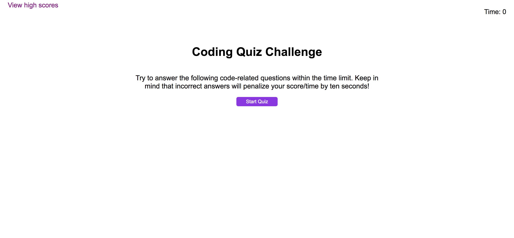

# Code Quiz

## Purpose
A website that tests basic JavaScript knowlege by asking multiple choice questons, if you answer wrong there is a 10 second penalty. Your score is how much time remains after all questions are answered.

## Built With 
HTML, CSS, and JavaScript

## Website
https://emilykidd3.github.io/password-generator/

## Screenshot

